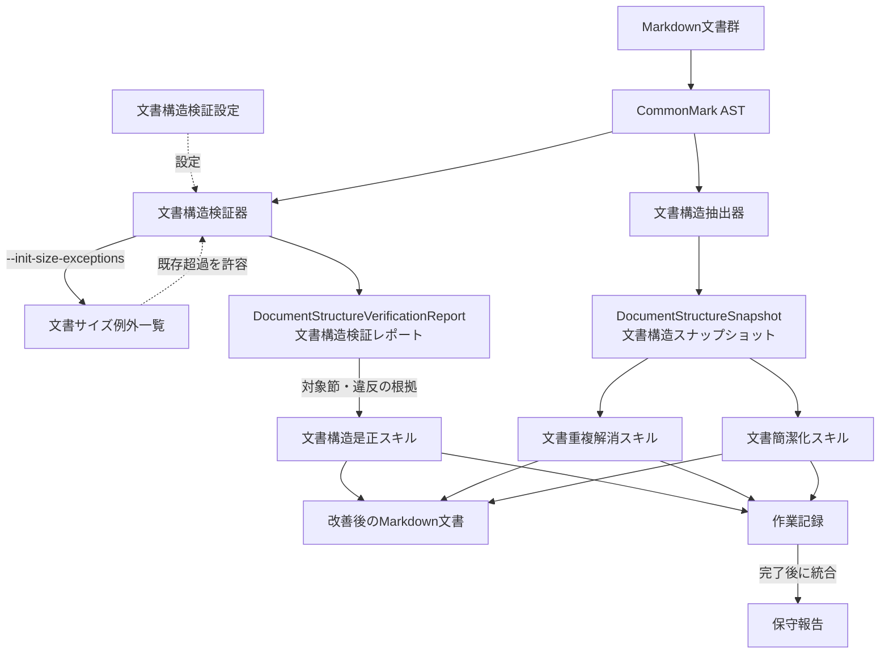

# verify-docs

Markdown文書群の検査・改善パッケージ。[文書構造検証器](docs/structure.md#文書構造検証器)・
[文書構造抽出器](docs/structure.md#文書構造抽出器)・
[文書構造是正スキル](.agents/skills/verify-docs/SKILL.md#文書構造是正スキル)・
[文書重複解消スキル](.agents/skills/dedupe-docs/SKILL.md#文書重複解消スキル)・
[文書簡潔化スキル](.agents/skills/tighten-docs/SKILL.md#文書簡潔化スキル)を同梱する。
CommonMark ASTを基盤に、参照整合性・文書構造・サイズ・重複を検査し、
文書構造の是正、意味的重複の解消、意味を保った簡潔化を支援する。明示的な
自律圧縮モードでは、多少の意味変更リスクを許容して圧縮・検査・記録まで完走する。
自律正本化モードでは、文書間の内容統合、新正本の作成、統合済み不要文書の削除まで完走する。

## 環境

- Node.js 22.23.2以上

## 導入

対象リポジトリのルートで次の一行を実行する。

```bash
curl -fsSL https://raw.githubusercontent.com/MichinaoShimizu/verify-docs/main/install.sh | bash
```

既存スキルがある導入先の扱いは[互換構成](docs/agent-compatibility.md)を参照。

## Skills

導入すると、以下の同梱スキルを使えるようになる。

| Skill | 内容 |
| --- | --- |
| [文書構造是正スキル](.agents/skills/verify-docs/SKILL.md#文書構造是正スキル) | <ul><li>リポジトリ内リンクの切れ、孤立文書、サイズ超過、同一段落の重複を検知する</li><li>検知結果に基づき、文書の置き場所と参照関係を整える</li><li>構造を確認し、必要な変更をMarkdown文書へ反映する</li><li><strong>実行</strong>: Claude Code/Kiro `/verify-docs`、Codex App `@verify-docs`、Codex CLI/IDE `$verify-docs`</li></ul> |
| [文書重複解消スキル](.agents/skills/dedupe-docs/SKILL.md#文書重複解消スキル) | <ul><li>言い換えを含む、同じ内容の重複を見つける</li><li>正本となる文書を一つ選ぶ</li><li>他の説明を正本への案内に置き換える</li><li>自律正本化モードでは、内容統合、新正本の作成、統合済み不要文書の削除まで行う</li><li><strong>実行</strong>: Claude Code/Kiro `/dedupe-docs 自律正本化モード`、Codex App `@dedupe-docs 自律正本化モード`、Codex CLI/IDE `$dedupe-docs 自律正本化モード`</li></ul> |
| [文書簡潔化スキル](.agents/skills/tighten-docs/SKILL.md#文書簡潔化スキル) | <ul><li>意味を変えずに削れる冗長な表現を見つける</li><li>不要な表現を削り、必要に応じて同一文書内の節を整理する</li><li>対象読者、条件、手順の順序を保ったまま文書を短くする</li><li>自律圧縮モードでは、多少の意味変更リスクを記録して圧縮を完走する</li><li><strong>実行</strong>: Claude Code/Kiro `/tighten-docs 自律圧縮モード`、Codex App `@tighten-docs 自律圧縮モード`、Codex CLI/IDE `$tighten-docs 自律圧縮モード`</li></ul> |

[推奨フロー](docs/workflow.md)を参照し、対象文書と導入済みスキルに合う順序で実行する。
同じ文書群で既定と自律モードを比べるときは、[文書保守モードの比較](docs/mode-comparison.md)を参照する。

自律モードを常用する場合は、リポジトリ直下の `verify-docs.config.json` で選ぶ。

```json
{
  "tighten": { "mode": "auto" },
  "dedupe": { "mode": "auto" }
}
```

設定がない場合、両スキルは `auto` で動く。`safe` と `auto` の意味は
[文書構造検証設定](docs/config.md#文書構造検証設定)を参照する。

CLIの詳細は[CLIリファレンス](docs/advanced-usage.md)を参照。

各Skillの作業結果はMarkdown文書に反映し、作業記録は[保守報告](docs/work-records-and-report.md#保守報告)へ統合する。

## 処理構成



## 設定ファイル

インストーラーは、設定がなければ全既定値入りの整形済みJSONを作り、既存の設定は保持する。
検査の動作を変えるときは、ルートの[文書構造検証設定](docs/config.md#文書構造検証設定)で
対象の項目だけを変更する。設定項目と入力制約は同設定の説明を参照。

## 関連文書

- [既存リポジトリへの導入、CI、文書サイズ例外の運用](docs/adoption.md)
- [CommonMark ASTによる構造解析と機械検査](docs/structure.md)
- [導入・検査・CI の運用オブジェクト](docs/operations.md)
- [エージェント間の互換構成](docs/agent-compatibility.md)
- [文書構造検証設定](docs/config.md#文書構造検証設定)
- [オブジェクトの名称・参照規約](docs/object-naming.md)
- [文書サイズ例外一覧の形式](docs/document-size-exceptions.md)
- [スキル補助文書の正本](docs/skill-references.md)
- [検出事項の是正手順](.agents/skills/verify-docs/SKILL.md)
- [この一式の改修作法](CONTRIBUTING.md)

## ライセンス

このパッケージは[MIT License](LICENSE)の下で提供する。

Markdown構文解析にはCommonMark.js 0.31.2を同梱している。第三者ライセンスは
[scripts/vendor/commonmark-LICENSE.txt](scripts/vendor/commonmark-LICENSE.txt)を参照。
